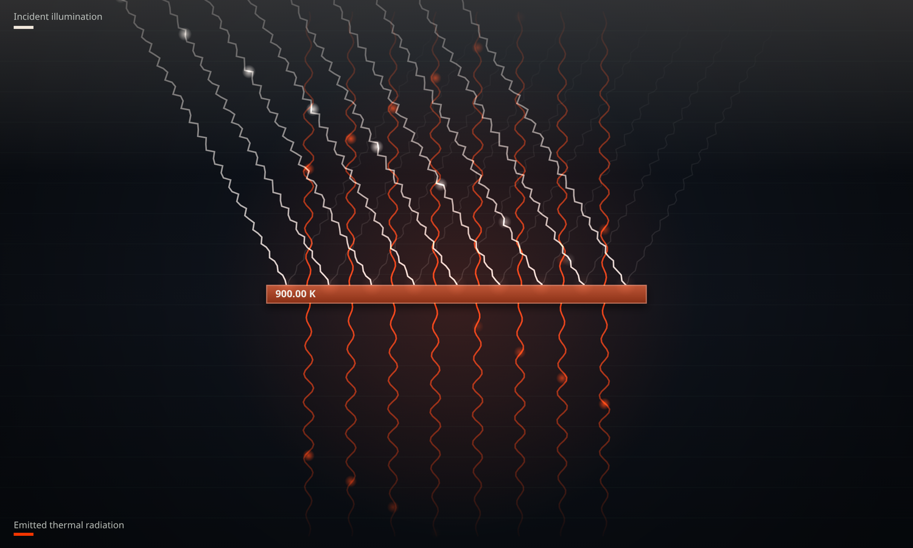
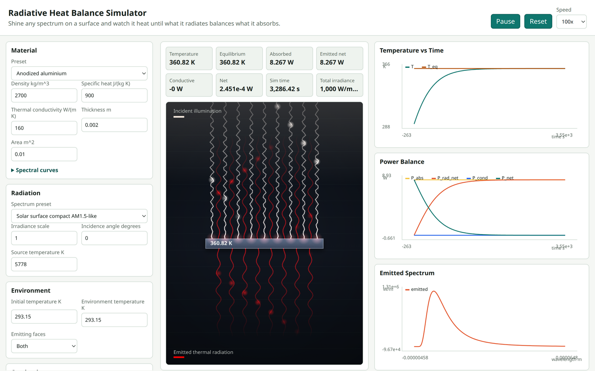
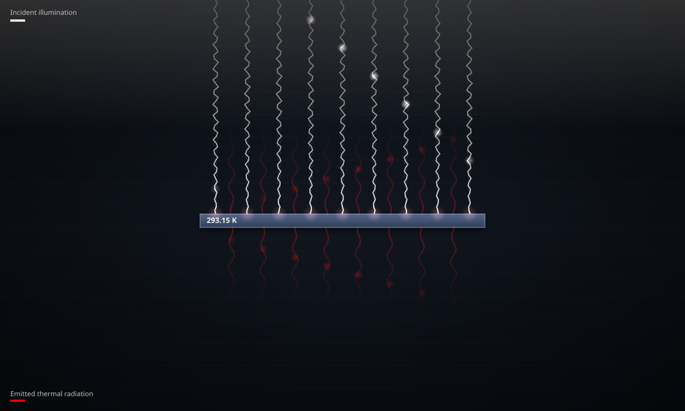

# Radiative Heat Balance Simulator

> Shine any spectrum on a surface and watch it heat until what it radiates balances what it absorbs.

**▶ Live demo: https://jdesbonnet.github.io/radiative-balance-sim/**



An interactive, in‑browser simulator of how a flat surface reaches thermal equilibrium when
illuminated by electromagnetic radiation. Incoming light is absorbed according to a
wavelength‑dependent absorptivity curve; the surface heats up and re‑radiates thermal energy
according to its temperature and a wavelength‑dependent emissivity curve. Temperature, the
power balance, and the emitted spectrum update live while the model runs.

It's meant to be **plausible and educational** rather than a high‑fidelity solver — compact,
approximate spectra and material curves that you can edit and explore.

---

## Features

- **Incident illumination** with spectrum presets — solar (AM1.5‑like / AM0‑like), an adjustable
  blackbody source, an infrared heater, and a narrow‑band 532 nm line — plus irradiance scale and
  angle of incidence.
- **Wavelength‑dependent absorptivity `α(λ)` and emissivity `ε(λ)`**, with editable curves and
  material presets (anodized aluminium, matte black paint, white paint, …).
- **Thermal emission** from Planck's law, integrated over wavelength, with selectable emitting
  faces (top / bottom / both) and net exchange against the environment.
- **Optional conductive exchange** (direct conductance or a geometry‑based model).
- **Live readouts** — temperature, estimated equilibrium temperature, absorbed / emitted / conductive
  / net power, and total irradiance.
- **Plots** — temperature vs time (with the equilibrium line), the full power balance, and the
  emitted spectrum, plus mini‑plots of the absorptivity / emissivity curves.
- **Real‑time playback** — play / pause / reset and speeds from 0.1× to 1000×.
- **An animated stage** that makes the energy flow legible (see below).

## The interface



The snapshot above is paused at **radiative equilibrium**: absorbed power (8.27 W) equals net emitted
power (8.27 W), the net power has fallen to ≈ 0, and the temperature curve has levelled onto the
equilibrium line — exactly the balance the app is built to show.

## Reading the animation

Both the incident and emitted radiation are drawn as travelling wave‑trains, and they encode the
physics rather than being decorative:

| | Incident illumination | Emitted thermal radiation |
|---|---|---|
| **Direction** | Streams in from above at the **angle of incidence** | Leaves the active face(s), drawn in the **gaps** between the incident rays |
| **Colour** | The source's colour — a Planck colour for thermal sources, or the true spectral hue for the laser line | The slab's Planck (incandescence) colour, deep red when cool, shifting toward orange/white when hot |
| **Wavelength** | Tight, short waves (visible/near‑IR) | **Longer** waves, tightening as the slab heats (Wien's law) |
| **Brightness** | ∝ incident irradiance | ∝ emitted exitance |

A faint **reflected** beam (the non‑absorbed fraction) bounces off at the specular angle as a cue to
absorptivity, and the slab develops an **incandescent glow** only once it is genuinely hot
(well above room temperature).

Crucially, **both intensities share one mapping from radiative power flux (W/m²) to on‑screen
brightness**, so equal flux reads as equal brightness:

```
brightness(Φ) = 0.12 + 0.70 · min(1, Φ / 1000 W·m⁻²)
   incident:  Φ = incident irradiance
   emitted:   Φ = σ · ε(λ_peak) · T⁴      (thermal exitance per face)
```

That's why a room‑temperature surface (left, 293 K) shows only faint red emission, while a hot one
(the hero image above, 900 K) blazes — and as a slab heats, you can literally watch the red waves
brighten to meet the incoming light as it approaches balance.



## The physics, briefly

A lumped, uniform‑temperature slab of area `A` and thickness `d`:

```
P_absorbed = A · cos(θ) · ∫ α(λ) · E(λ) dλ
P_emitted  = A · n_faces · ∫ ε(λ) · [ M_bb(λ, T) − M_bb(λ, T_env) ] dλ
P_cond     = G · (T_boundary − T)
dT/dt      = (P_absorbed + P_cond − P_emitted) / (ρ · A · d · c_p)
```

where `M_bb` is the Planck spectral exitance. The slab integrates forward in time until
`P_net → 0` (radiative/conductive equilibrium). Everything is in **SI units**. Spectra and material
curves are compact, plausible approximations — see [`DESIGN.md`](DESIGN.md) for the full model,
assumptions, and the rationale behind the version‑1 decisions.

## Running locally

It's a static site with **no build step and no dependencies**. Either open `index.html` directly, or
serve the folder (recommended, avoids any `file://` quirks):

```bash
python3 -m http.server 8000
# then open http://localhost:8000/
```

## Project structure

```
index.html                 markup + script load order
src/
  simulation/              pure physics — Planck, integration, spectra, materials,
                           the thermal model, equilibrium solver, validation
  state.js                 application state + defaults
  controls.js              wiring the control panel to state
  visualization.js         the animated radiation/heat-balance stage (canvas 2D)
  plots.js                 time-series and spectrum plots
  main.js                  the requestAnimationFrame loop
  styles/app.css           layout and theme
DESIGN.md                  design document and physics model
```

Built with plain HTML, JavaScript, and the Canvas 2D API.

## License

[MIT](LICENSE)
